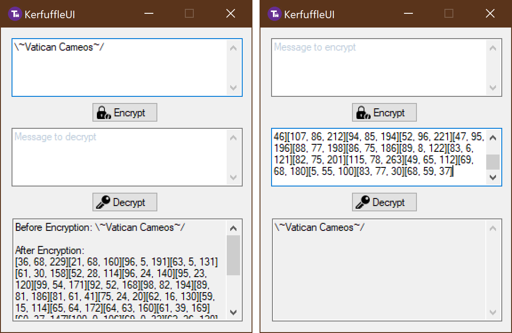

# Kerfuffle Cipher

> Text to Matrix Encryption Algorithm

## Description

Download: https://github.com/ReignOfComputer/KerfuffleCipher/releases

Back in 2014 I had to do some project on using matrices for text encryption. The source code from back then was lost, so most of this is reverse engineered from a copy of the compiled binary that I found.

  

## Excerpts from the Paper (Written 24 Jan 2014)

### Introduction

We have been given the task of creating a secure system utilizing matrices, and our group came out, to the best of our ability, with the Kerfuffle Cipher. The word 'Kerfuffle' means "to put into disorder or disarray", which we felt was fitting for the nature of the cipher’s calculations.

### The Kerfuffle Cipher

The Kerfuffle Cipher relays messages and data through matrices, represented as arrays in programming languages. Each character in a message will be represented by a 3x1 matrix. To start off, here are a few examples as to how some characters are expressed:-
1. A = `[1, 1, 35]`
2. B = `[2, 1, 40]`
3. b = `[2, 1, 23]`
4. M = `[13, 1, 43]`
5. N = `[1, 2, 32]`
6. ! = `[1, 2, 67]`

The entirety of a character's structure in the Kerfuffle Cipher is as follows:-

`[x, y, z]`

Where x represents the **index of a character within a character set**, y the **character set**, and z the **type of character**. There are two character sets (y) '1' and '2', representing 'A' to 'M' and 'N' to 'Z' respectively. The index (x) therefore ranges from '1' (A or N) to '13' (M or Z), where the output depends on the character set specified in the matrix. The type of character (z) can be 0-25 (alphabet, lower case), 26-50 (alphabet, upper case), 51-75, (special character), or 76-100 (numbers).

### Transmission

With that in mind, when data is transmitted, we have decided to increase the complexity of the data chain being sent. Every character will be sent as a block of two (3x2 matrix) which will be resolved by the decrypter on the receiving end using a simple mathematical calculation.

The second column will consist of 3 randomly generated numbers and will add itself to the initial data, like so:-

`[x, y, z] + [a, b, c] = [x + a, y + b, z + c]`

`[4, 1, 1] + [76, 48, 57] = [80, 49, 58]`

The calculated result will then be sent together with the randomly generated matrix in the form:-

`[x + a, y + b, z + c][a, b, c]`

`[80, 49, 58][76, 48, 57]`

When the decrypter receives the above 3x2 matrix, it will simply undo the mathematical calculation by subtracting the right hand side from the left to derive the original data, which it will then translate to the character.

### Additional Security

Because of the way the data is randomized and therefore always different, it is difficult for someone to reverse engineer the way the data is encrypted. However, just to be sure, we have added a many more lines of defence to the Kerfuffle Cipher.

For every 6 characters sent, we will send another block of 3x2 matrix that will contain only garbled data that will be ignored by the decrypter.

In addition to that, we will be swapping the first matrix with the second matrix for symbols when the value for z is 51 to 75 (indicating a symbol).

For example:-

**! =** `[1, 1, 57]`

**Rand =** `[68, 42, 95]`

**Transmission Matrix for ! =** `[68, 42, 95][69, 43, 152]`

This, together with the garbled message, will confuse those who intend to reverse engineer because it is not always the first matrix subtracted by the second matrix. With this, only symbols will be put into this calculation because the first matrix subtracted by the second matrix gives you negative digits which indicates it is a symbol, so you have to use the second matrix subtracted by the first matrix. However, the reverse engineers might not know that the calculation is reversed, where the second matrix minus the first gives the information for a symbol instead. 

The security checks above do not, however, prevent data from being modified. We have thus added a byte check in the random 3x1 matrix. The last integer will be the byte value for the character. A computer is able to interpret characters as bytes and vice versa. For example, A will be 65, B will be 66, C will be 67, D will be 68, etc. This check is to ensure that in the event of data tampering due to a man-in-the-middle attack or other malicious activity, the decryption process will detect that the character does not fit with the corresponding character generated from the byte. The last digit of the 3x1 random matrix will therefore be the sum of the 2nd digit and the byte check, as follows:-

[84 68 **B**]

**B** will be the sum of 65 and the byte value of the character.

`[84, 68, 68 + 65]`

When the character is A, the byte value is 65.

Lastly, we have added another piece of garbled data in a single 3x1 matrix at the end of a transmission. This is not added every time and occurs 50% of the time. With this, the number of rows in the matrix that is sent is not always even and will therefore confuse reverse engineers further.

### Example

**Text =** `\~Vatican Cameos~/`

**Raw =** `[15, 3, 74][33, 3, 53][9, 2, 49][1, 1, 19][7, 2, 5][9, 1, 20][3, 1, 9][1, 1, 8][1, 2, 4][31, 3, 68][3, 1, 31][1, 1, 13][13, 1, 18][5, 1, 25][2, 2, 12][6, 2, 1][33, 3, 62][20, 3, 68]`

**Transmit =** `[35, 37, 129][50, 40, 203][76, 13, 139][109, 16, 192][34, 63, 196][25, 61, 147][14, 66, 181][13, 65, 162][84, 58, 177][77, 56, 172][15, 94, 218][6, 93, 198][56, 65, 52][52, 47, 98][64, 53, 160][61, 52, 151][79, 33, 137][78, 32, 129][83, 65, 177][82, 63, 173][61, 94, 191][30, 91, 123][63, 53, 150][60, 52, 119][92, 17, 126][91, 16, 113][97, 17, 94][91, 91, 46][107, 86, 212][94, 85, 194][52, 96, 221][47, 95, 196][88, 77, 198][86, 75, 186][89, 8, 122][83, 6, 121][82, 75, 201][115, 78, 263][49, 65, 112][69, 68, 180][5, 55, 100][83, 77, 30][68, 59, 37]`

## Usage

### Example Application (KerfuffleUI)

1. Encrypt Button encrypts text to matrices
2. Decrypt Button decrypts matrices to text

### Library (KerfuffleCipher.dll)

Sorry - too lazy to write proper docs

1. `Encryption.InsertGarbledText(string text)`: Adds the trick character every 6th position
2. `Encryption.Encrypt(string text)`: Returns the encrypted text as multidimensional array int[,,]
3. `Encryption.DisplayMatrix(int[,,] array)`: Returns a formatted string of the encrypted matrices
4. `Decryption.DisplayArrayFromString(string text)`: Returns a multidimensional array formatted representation of the plaintext matrices
5. `Decryption.Decrypt(int[,,] array)`: Returns the raw matrix
6. `Decryption.GetMessage(int[,] array)`: Turns the raw matrix into plaintext

e.g. `Encryption.DisplayMatrix(Encryption.Encrypt(Encryption.InsertGarbledText(encryptBox.Text));`

e.g. `Decryption.GetMessage(Decryption.Decrypt(Decryption.DisplayArrayFromString(decryptBox.Text)))`

### 

## License

[MIT License](https://github.com/ReignOfComputer/KerfuffleCipher/blob/master/LICENSE) | &copy; 2019 ReignOfComputer